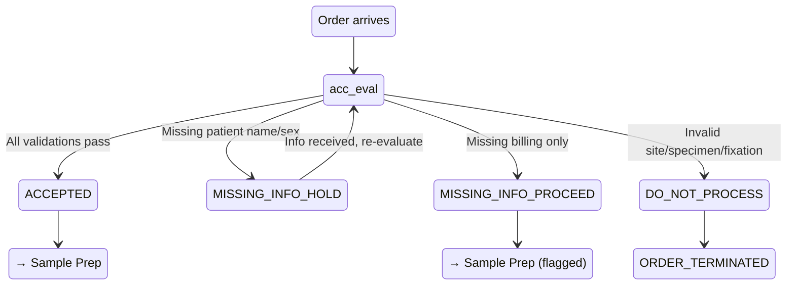
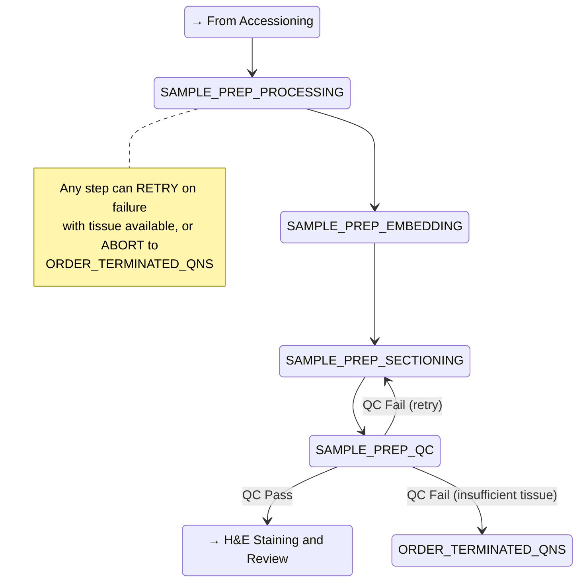
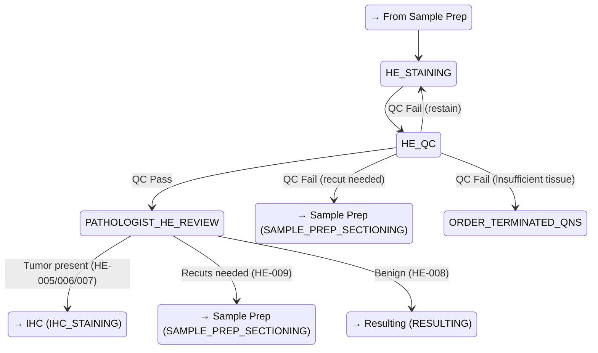
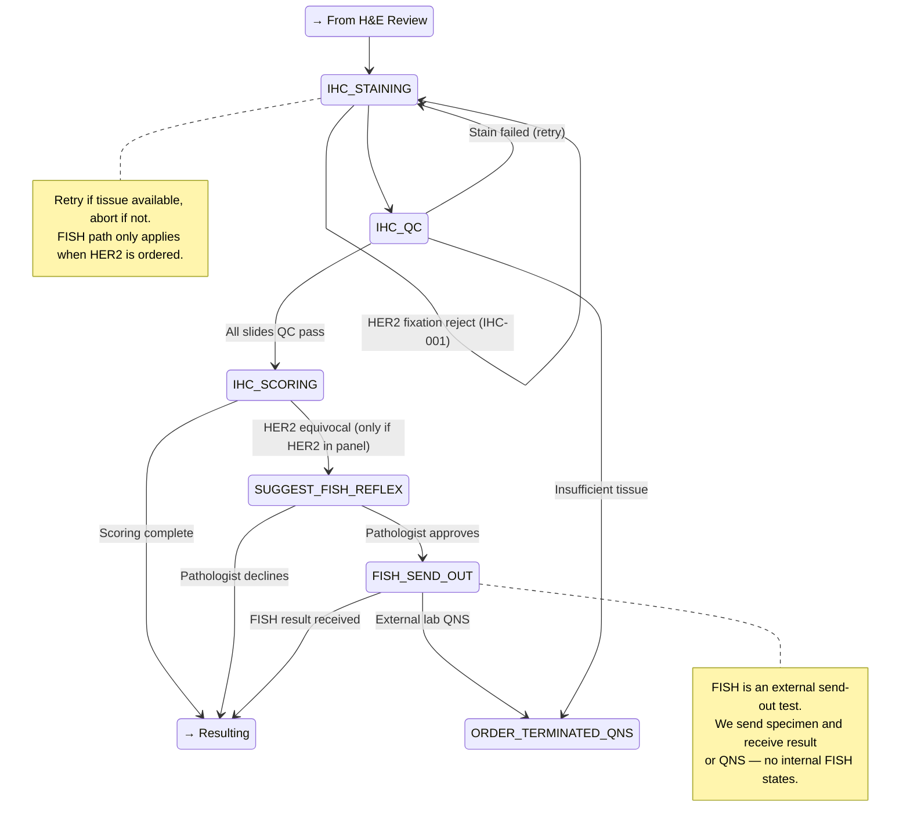
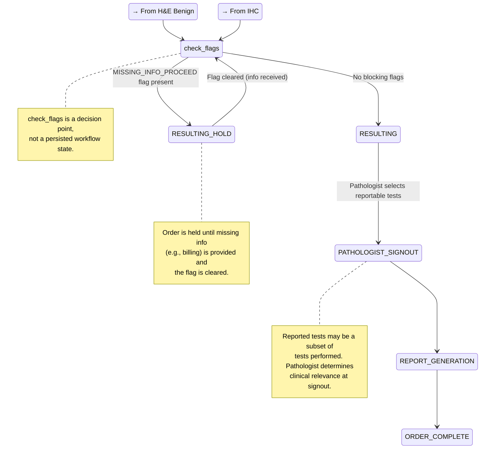

# Workflow Overview

This document defines the breast cancer laboratory workflow — the states, transitions, and terminal conditions that govern how a specimen moves from accessioning through resulting.

## Scope

The laboratory processes **breast cancer specimens only**. Other anatomic sites may arrive but are rejected. The workflow covers accessioning through resulting for immunohistochemistry (IHC) testing.

## Core Principle

The workflow routing system is a **traffic cop**, not a diagnostician. It routes orders between steps and suggests next actions. All clinical decisions (diagnosis, scoring, marker selection for atypical cases) require pathologist approval. The system never makes autonomous clinical decisions.

## Workflow States

```text
ACCESSIONING
  ├── ACCEPTED → SAMPLE_PREP_PROCESSING
  ├── MISSING_INFO_PROCEED → SAMPLE_PREP_PROCESSING (but blocked before resulting)
  ├── MISSING_INFO_HOLD → (wait for info) → re-evaluate all rules
  └── DO_NOT_PROCESS → ORDER_TERMINATED

SAMPLE_PREP_PROCESSING → SAMPLE_PREP_EMBEDDING → SAMPLE_PREP_SECTIONING → SAMPLE_PREP_QC
  (at any step before QC: RETRY on failure with tissue available; ABORT if insufficient tissue → ORDER_TERMINATED_QNS)
  QC checks: section thickness, tissue integrity, mounting quality
  QC outcomes:
  ├── QC_PASS → HE_STAINING
  └── QC_FAIL → RETRY (back to SAMPLE_PREP_SECTIONING) or ABORT if insufficient tissue

H&E STAINING AND REVIEW:
HE_STAINING → HE_QC → PATHOLOGIST_HE_REVIEW
  HE QC checks: stain quality, uniformity, artifact assessment
  HE QC outcomes:
  ├── QC_PASS → PATHOLOGIST_HE_REVIEW
  ├── QC_FAIL (restain) → HE_STAINING
  ├── QC_FAIL (recut needed, tissue available) → SAMPLE_PREP_SECTIONING
  └── QC_FAIL (insufficient tissue) → ORDER_TERMINATED_QNS
  Pathologist review outcomes:
  ├── Tumor present (standard panel or pathologist-customized panel) → IHC_STAINING
  ├── Recuts needed → SAMPLE_PREP_SECTIONING
  └── Benign diagnosis → RESULTING (IHC cancelled)

IHC_STAINING → IHC_QC → IHC_SCORING
  IHC QC checks: stain quality and controls (pass/fail per slide)
  Events arrive per-slide (e.g., "ER slide QC passed", "HER2 slide QC failed")
  Model must track partial completion — some slides may pass while others need retry
  (retry if tissue available; abort if insufficient tissue)
  Scoring is quantitative: HER2 (0, 1+, 2+, 3+), ER/PR (percentage), Ki-67 (percentage)
  Scoring outcomes:
  ├── SCORING_COMPLETE → RESULTING
  └── HER2_EQUIVOCAL → SUGGEST_FISH_REFLEX (requires pathologist approval)
        ├── FISH_APPROVED → FISH_SEND_OUT (external test) → RESULTING or ORDER_TERMINATED_QNS
        └── FISH_DECLINED → RESULTING

RESULTING (check MISSING_INFO_PROCEED flag — hold if present, proceed if cleared)
  → PATHOLOGIST_SIGNOUT → REPORT_GENERATION → ORDER_COMPLETE
  At signout, pathologist determines which tests are included in the final report.
  Reported tests may be a subset of tests performed (pathologist discretion on clinical relevance).
  The set of reported tests is captured for downstream billing and clinical systems.
```

## Workflow Diagrams

### Accessioning



### Sample Prep



### H&E Staining and Review



### IHC



### Resulting



## State-to-Step Mapping

The state machine maps workflow states to rule-catalog steps for rule evaluation. This mapping lives in `src/workflow/state_machine.py` (`_STATE_TO_STEP`). Scenario authors need to know which states trigger which rules.

| State(s) | Rule-Catalog Step | Evaluation Mode | Notes |
|---|---|---|---|
| `ACCESSIONING` | `ACCESSIONING` | All-match | Every rule evaluated; actions accumulate by severity |
| `ACCEPTED`, `MISSING_INFO_PROCEED`, `SAMPLE_PREP_PROCESSING`, `SAMPLE_PREP_EMBEDDING`, `SAMPLE_PREP_SECTIONING`, `SAMPLE_PREP_QC` | `SAMPLE_PREP` | First-match, priority-ordered | ACCEPTED and MISSING_INFO_PROCEED are mapped to SAMPLE_PREP so grossing_complete events can fire SP-001 at those states |
| `HE_QC` | `HE_QC` | First-match, priority-ordered | |
| `PATHOLOGIST_HE_REVIEW` | `PATHOLOGIST_HE_REVIEW` | First-match, priority-ordered | |
| `IHC_STAINING`, `IHC_QC`, `IHC_SCORING`, `SUGGEST_FISH_REFLEX`, `FISH_SEND_OUT` | `IHC` (per-rule `applies_at`) | First-match, priority-ordered | Each IHC rule specifies which state it applies at via `applies_at` |
| `RESULTING`, `RESULTING_HOLD`, `PATHOLOGIST_SIGNOUT`, `REPORT_GENERATION` | `RESULTING` | First-match, priority-ordered | |
| `MISSING_INFO_HOLD`, `DO_NOT_PROCESS`, `HE_STAINING` | (none) | Pass-through | Transient states; no rules evaluated |
| `ORDER_COMPLETE`, `ORDER_TERMINATED`, `ORDER_TERMINATED_QNS` | (none) | Terminal | No rules evaluated |

## Terminal States

Orders can reach terminal states from multiple phases:
- **ORDER_TERMINATED** — from Accessioning (DO_NOT_PROCESS)
- **ORDER_TERMINATED_QNS** — from Sample Prep, H&E, or IHC (insufficient tissue)
- **ORDER_COMPLETE** — from Resulting (normal completion)

## Fixation Check

HER2 testing requires formalin fixation with fixation time between 6-72 hours. This check applies:

- At accessioning: if HER2 is ordered and fixation is out of tolerance -> DO_NOT_PROCESS
- At IHC stage: if HER2 becomes needed (pathologist adds it) but fixation is out of tolerance -> reject specimen for HER2, flag to pathologist

## Related Documents

- [Rule Catalog](rule-catalog.md) — all workflow rules by step
- [Accessioning Logic](accessioning-logic.md) — detailed accessioning decision logic
- [Pathologist Review Panels](pathologist-review-panels.md) — IHC panel mappings
