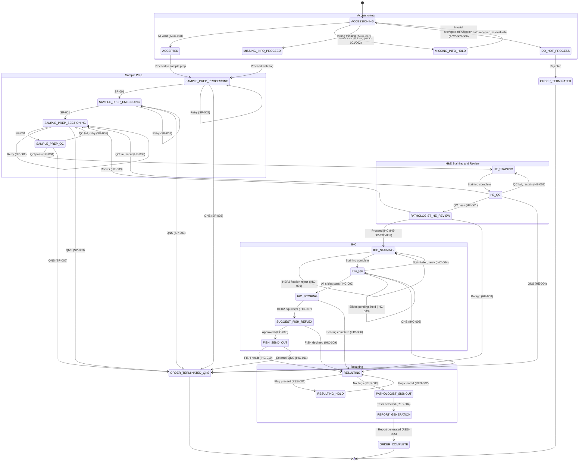

# Breast Cancer Laboratory Workflow State Machine

This document is a human-readable rendering of `workflow_states.yaml` — the machine-readable source of truth for the workflow state machine. It is structured for section-aware chunking in the RAG pipeline.

## State Diagram

## Workflow States

### Accessioning Phase

| State | Description | Terminal |
|-------|-------------|----------|
| ACCESSIONING | Order arrives; all validation rules evaluated simultaneously | No |
| ACCEPTED | All validations pass; order proceeds to sample prep | No |
| MISSING_INFO_HOLD | Critical info missing (patient name/sex); order held until resolved | No |
| MISSING_INFO_PROCEED | Non-critical info missing (billing); order proceeds with flag | No |
| DO_NOT_PROCESS | Order rejected (invalid site, specimen, or fixation) | No |

### Sample Prep Phase

| State | Description | Terminal |
|-------|-------------|----------|
| SAMPLE_PREP_PROCESSING | Tissue processing (dehydration, clearing, infiltration) | No |
| SAMPLE_PREP_EMBEDDING | Paraffin embedding | No |
| SAMPLE_PREP_SECTIONING | Microtomy — cutting thin sections from paraffin block | No |
| SAMPLE_PREP_QC | QC checks: section thickness, tissue integrity, mounting quality | No |

### H&E Staining and Review Phase

| State | Description | Terminal |
|-------|-------------|----------|
| HE_STAINING | Hematoxylin and eosin staining | No |
| HE_QC | H&E QC checks: stain quality, uniformity, artifact assessment | No |
| PATHOLOGIST_HE_REVIEW | Pathologist reviews H&E slides and determines diagnosis/IHC panel | No |

### IHC Phase

| State | Description | Terminal |
|-------|-------------|----------|
| IHC_STAINING | Immunohistochemistry staining (per-slide, per-marker) | No |
| IHC_QC | IHC stain quality and controls check (per-slide pass/fail) | No |
| IHC_SCORING | Quantitative scoring: HER2 (0/1+/2+/3+), ER/PR (%), Ki-67 (%) | No |
| SUGGEST_FISH_REFLEX | HER2 equivocal; FISH reflex suggested pending pathologist approval | No |
| FISH_SEND_OUT | Specimen sent to external lab for FISH testing | No |

### Resulting Phase

| State | Description | Terminal |
|-------|-------------|----------|
| RESULTING | All testing complete, no blocking flags; ready for signout | No |
| RESULTING_HOLD | Blocked by MISSING_INFO_PROCEED flag; held until info received | No |
| PATHOLOGIST_SIGNOUT | Pathologist selects reportable tests from tests performed | No |
| REPORT_GENERATION | Final report generated with pathologist-selected tests | No |

### Terminal States

| State | Description |
|-------|-------------|
| ORDER_COMPLETE | Normal completion — report generated and released |
| ORDER_TERMINATED | Order rejected at accessioning (DO_NOT_PROCESS) |
| ORDER_TERMINATED_QNS | Quantity not sufficient — insufficient tissue at any step |

Terminal states have no outgoing transitions.

## Valid Transitions

### Accessioning Transitions

| From | To | Condition |
|------|----|-----------|
| ACCESSIONING | ACCEPTED | All validations pass (ACC-008) |
| ACCESSIONING | MISSING_INFO_HOLD | Critical info missing — patient name (ACC-001) or sex (ACC-002) |
| ACCESSIONING | MISSING_INFO_PROCEED | Only non-critical info missing — billing (ACC-007) |
| ACCESSIONING | DO_NOT_PROCESS | Invalid site (ACC-003), specimen type (ACC-004), or HER2 fixation (ACC-005, ACC-006) |
| MISSING_INFO_HOLD | ACCESSIONING | Missing info received; re-evaluate all accessioning rules |
| ACCEPTED | SAMPLE_PREP_PROCESSING | Order accepted, proceed to sample prep |
| MISSING_INFO_PROCEED | SAMPLE_PREP_PROCESSING | Order proceeds with MISSING_INFO_PROCEED flag set |
| DO_NOT_PROCESS | ORDER_TERMINATED | Order rejected at accessioning |

### Sample Prep Transitions

| From | To | Condition |
|------|----|-----------|
| SAMPLE_PREP_PROCESSING | SAMPLE_PREP_EMBEDDING | Processing completed successfully (SP-001) |
| SAMPLE_PREP_PROCESSING | SAMPLE_PREP_PROCESSING | Step failed, tissue available — retry (SP-002) |
| SAMPLE_PREP_EMBEDDING | SAMPLE_PREP_SECTIONING | Embedding completed successfully (SP-001) |
| SAMPLE_PREP_EMBEDDING | SAMPLE_PREP_EMBEDDING | Step failed, tissue available — retry (SP-002) |
| SAMPLE_PREP_SECTIONING | SAMPLE_PREP_QC | Sectioning completed successfully (SP-001) |
| SAMPLE_PREP_SECTIONING | SAMPLE_PREP_SECTIONING | Step failed, tissue available — retry (SP-002) |
| SAMPLE_PREP_QC | HE_STAINING | QC passes (SP-004) |
| SAMPLE_PREP_QC | SAMPLE_PREP_SECTIONING | QC fails, tissue available for retry (SP-005) |
| SAMPLE_PREP_QC | ORDER_TERMINATED_QNS | QC fails, insufficient tissue (SP-006) |
| SAMPLE_PREP_PROCESSING | ORDER_TERMINATED_QNS | Step failed, insufficient tissue (SP-003) |
| SAMPLE_PREP_EMBEDDING | ORDER_TERMINATED_QNS | Step failed, insufficient tissue (SP-003) |
| SAMPLE_PREP_SECTIONING | ORDER_TERMINATED_QNS | Step failed, insufficient tissue (SP-003) |

### H&E Staining and Review Transitions

| From | To | Condition |
|------|----|-----------|
| HE_STAINING | HE_QC | H&E staining completed |
| HE_QC | PATHOLOGIST_HE_REVIEW | H&E QC passes (HE-001) |
| HE_QC | HE_STAINING | H&E QC fails, restain possible (HE-002) |
| HE_QC | SAMPLE_PREP_SECTIONING | H&E QC fails, recut needed, tissue available (HE-003) |
| HE_QC | ORDER_TERMINATED_QNS | H&E QC fails, insufficient tissue (HE-004) |
| PATHOLOGIST_HE_REVIEW | IHC_STAINING | Diagnosis: invasive carcinoma (HE-005), DCIS (HE-006), or suspicious/atypical (HE-007) |
| PATHOLOGIST_HE_REVIEW | RESULTING | Diagnosis: benign — cancel IHC (HE-008) |
| PATHOLOGIST_HE_REVIEW | SAMPLE_PREP_SECTIONING | Pathologist requests recuts (HE-009) |

### IHC Transitions

| From | To | Condition |
|------|----|-----------|
| IHC_STAINING | IHC_STAINING | HER2 fixation out of tolerance — reject HER2, continue remaining markers (IHC-001) |
| IHC_STAINING | IHC_QC | IHC staining completed |
| IHC_QC | IHC_SCORING | All slides stained and QC passed (IHC-002) |
| IHC_QC | IHC_QC | Some slides still pending — hold, wait for remaining slides (IHC-003) |
| IHC_QC | IHC_STAINING | Staining failed, retry (IHC-004) |
| IHC_QC | ORDER_TERMINATED_QNS | Staining failed, insufficient tissue (IHC-005) |
| IHC_SCORING | RESULTING | Scoring complete, no equivocal results (IHC-006) |
| IHC_SCORING | SUGGEST_FISH_REFLEX | HER2 equivocal (IHC-007) |
| SUGGEST_FISH_REFLEX | FISH_SEND_OUT | Pathologist approves FISH reflex (IHC-008) |
| SUGGEST_FISH_REFLEX | RESULTING | Pathologist declines FISH reflex (IHC-009) |
| FISH_SEND_OUT | RESULTING | FISH result received, proceed to resulting (IHC-010) |
| FISH_SEND_OUT | ORDER_TERMINATED_QNS | External lab returns QNS (IHC-011) |

### Resulting Transitions

| From | To | Condition |
|------|----|-----------|
| RESULTING | RESULTING_HOLD | MISSING_INFO_PROCEED flag present (RES-001) |
| RESULTING_HOLD | RESULTING | Info received and flag cleared (RES-002) |
| RESULTING | PATHOLOGIST_SIGNOUT | All testing complete, no blocking flags (RES-003) |
| PATHOLOGIST_SIGNOUT | REPORT_GENERATION | Pathologist selects reportable tests (RES-004) |
| REPORT_GENERATION | ORDER_COMPLETE | Report generated (RES-005) |

## Rule Catalog

### Accessioning Rules (Severity-Based, All-Match Evaluation)

All accessioning rules are evaluated on every order. Multiple rules can fire simultaneously. The final routing is determined by the highest-severity outcome: REJECT > HOLD > PROCEED > ACCEPT.

| Rule ID | Trigger | Action | Severity |
|---------|---------|--------|----------|
| ACC-001 | Patient name missing | MISSING_INFO_HOLD — hold order, request patient name | HOLD |
| ACC-002 | Patient sex missing | MISSING_INFO_HOLD — hold order, request patient sex | HOLD |
| ACC-003 | Anatomic site not breast-cancer-relevant | DO_NOT_PROCESS | REJECT |
| ACC-004 | Specimen type incompatible with histology workflow (e.g., FNA) or unrecognized | DO_NOT_PROCESS | REJECT |
| ACC-005 | HER2 ordered and fixative is not formalin | DO_NOT_PROCESS | REJECT |
| ACC-006 | HER2 ordered and fixation time outside 6-72 hours | DO_NOT_PROCESS | REJECT |
| ACC-007 | Billing info missing | MISSING_INFO_PROCEED — proceed with flag | PROCEED |
| ACC-008 | All validations pass | ACCEPTED | ACCEPT |

### Sample Prep Rules (Priority-Based, First-Match Evaluation)

| Rule ID | Trigger | Action | Priority |
|---------|---------|--------|----------|
| SP-001 | Step completed successfully | Advance to next sample prep step | 1 |
| SP-002 | Step failed, tissue available | RETRY current step | 2 |
| SP-003 | Step failed, insufficient tissue | ABORT — ORDER_TERMINATED_QNS | 3 |
| SP-004 | Sample prep QC passes | Advance to HE_STAINING | 4 |
| SP-005 | Sample prep QC fails, tissue available | RETRY — back to SAMPLE_PREP_SECTIONING | 5 |
| SP-006 | Sample prep QC fails, insufficient tissue | ABORT — ORDER_TERMINATED_QNS | 6 |

### H&E QC Rules (Priority-Based, First-Match Evaluation)

| Rule ID | Step | Trigger | Action | Priority |
|---------|------|---------|--------|----------|
| HE-001 | HE_QC | H&E QC passes | Route to PATHOLOGIST_HE_REVIEW | 1 |
| HE-002 | HE_QC | H&E QC fails, restain possible | RETRY — back to HE_STAINING | 2 |
| HE-003 | HE_QC | H&E QC fails, recut needed, tissue available | RETRY — back to SAMPLE_PREP_SECTIONING | 3 |
| HE-004 | HE_QC | H&E QC fails, insufficient tissue | ABORT — ORDER_TERMINATED_QNS | 4 |

### Pathologist H&E Review Rules (Priority-Based, First-Match Evaluation)

| Rule ID | Step | Trigger | Action | Priority |
|---------|------|---------|--------|----------|
| HE-005 | PATHOLOGIST_HE_REVIEW | Pathologist diagnosis: invasive carcinoma | PROCEED_IHC — standard panel: ER, PR, HER2, Ki-67 | 1 |
| HE-006 | PATHOLOGIST_HE_REVIEW | Pathologist diagnosis: DCIS | PROCEED_IHC — standard panel: ER, PR; HER2 only if ordered | 2 |
| HE-007 | PATHOLOGIST_HE_REVIEW | Pathologist diagnosis: suspicious/atypical | PROCEED_IHC — pathologist-customized panel | 3 |
| HE-008 | PATHOLOGIST_HE_REVIEW | Pathologist diagnosis: benign | CANCEL_IHC_BENIGN — route to RESULTING | 4 |
| HE-009 | PATHOLOGIST_HE_REVIEW | Pathologist requests recuts | REQUEST_RECUTS — back to SAMPLE_PREP_SECTIONING | 5 |

### IHC Rules (Priority-Based, First-Match Evaluation)

| Rule ID | Trigger | Action | Priority |
|---------|---------|--------|----------|
| IHC-001 | HER2 added by pathologist and fixation out of tolerance | Reject specimen for HER2, flag to pathologist (set HER2_FIXATION_REJECT) | 1 |
| IHC-002 | All slides stained and QC passed | Route to IHC_SCORING | 2 |
| IHC-003 | Some slides still pending | HOLD — wait for remaining slides | 3 |
| IHC-004 | Staining failed | RETRY staining | 4 |
| IHC-005 | Staining failed, insufficient tissue | ABORT — ORDER_TERMINATED_QNS | 5 |
| IHC-006 | Scoring complete, no equivocal results | Route to RESULTING | 6 |
| IHC-007 | HER2 equivocal | SUGGEST_FISH_REFLEX — requires pathologist approval | 7 |
| IHC-008 | Pathologist approves FISH reflex | FISH_SEND_OUT — external test | 8 |
| IHC-009 | Pathologist declines FISH reflex | Route to RESULTING | 9 |
| IHC-010 | FISH result received | Route to RESULTING | 10 |
| IHC-011 | FISH external lab returns QNS | ABORT — ORDER_TERMINATED_QNS | 11 |

### Resulting Rules (Priority-Based, First-Match Evaluation)

| Rule ID | Trigger | Action | Priority |
|---------|---------|--------|----------|
| RES-001 | MISSING_INFO_PROCEED flag present | RESULTING_HOLD — block until info received | 1 |
| RES-002 | Info received, re-evaluate flags | If flag cleared proceed to RESULTING; if still missing remain in RESULTING_HOLD | 2 |
| RES-003 | All scoring/testing complete, no blocking flags | Route to PATHOLOGIST_SIGNOUT | 3 |
| RES-004 | Pathologist selects reportable tests | Route to REPORT_GENERATION (update slide reported flags) | 4 |
| RES-005 | Report generated | ORDER_COMPLETE | 5 |

## Accessioning Evaluation Logic

All accessioning rules use **severity-based, all-match evaluation** — every rule is evaluated on every order and the model must report all matching rules. The final routing is determined by the highest-severity outcome:

1. **REJECT** — DO_NOT_PROCESS (order rejected)
2. **HOLD** — MISSING_INFO_HOLD (order held, critical info needed)
3. **PROCEED** — MISSING_INFO_PROCEED (order proceeds with flag)
4. **ACCEPT** — ACCEPTED (no issues)

All other workflow steps use **priority-based, first-match evaluation**.

## Flag Vocabulary

Flags are accumulated state that carries forward across the order lifecycle. The routing system may set flags as part of its output, and must consider existing flags when making decisions.

| Flag | Set At | Effect | Cleared By |
|------|--------|--------|------------|
| MISSING_INFO_PROCEED | ACCESSIONING | Blocks resulting until info is resolved; order proceeds through IHC normally | Missing info received |
| FIXATION_WARNING | ACCESSIONING, IHC | Alerts that fixation was borderline or needs review | Pathologist review |
| RECUT_REQUESTED | PATHOLOGIST_HE_REVIEW | Tracks that slides were recut (affects tissue availability assessment) | Recut completed |
| HER2_FIXATION_REJECT | IHC | HER2 rejected due to fixation out of tolerance, flagged to pathologist | Pathologist decision |
| FISH_SUGGESTED | IHC_SCORING | HER2 equivocal, FISH reflex suggested pending pathologist approval | Pathologist approves or declines FISH |

Flags are stored in the order's `flags` array and persist until explicitly resolved.
